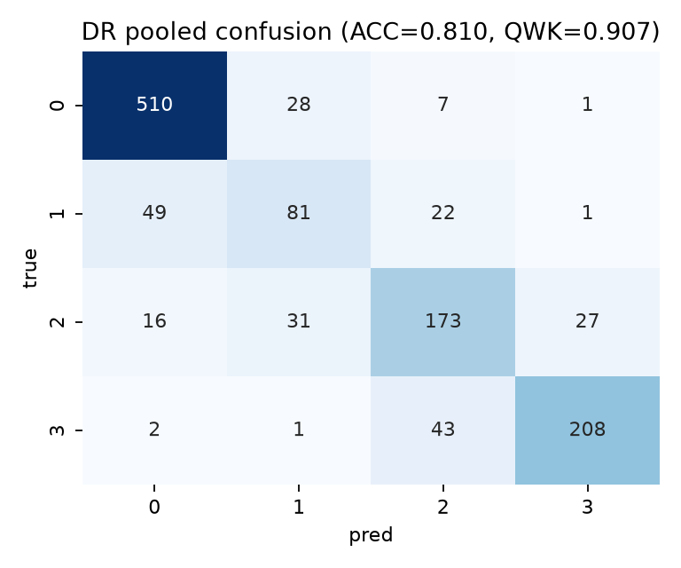
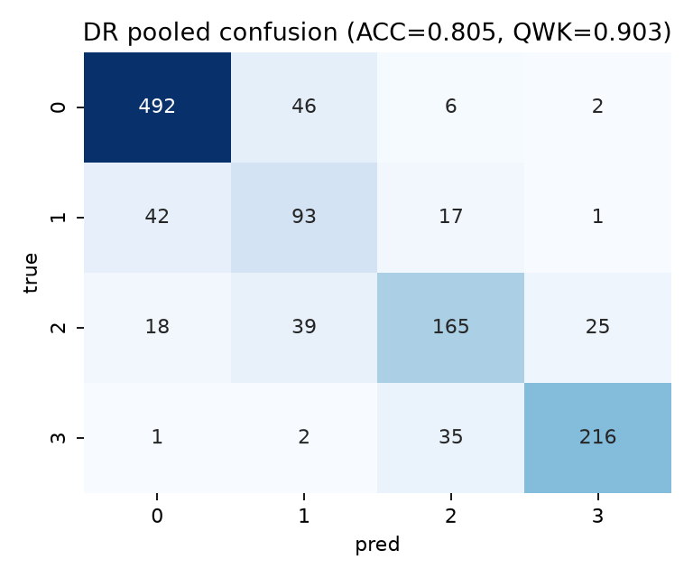
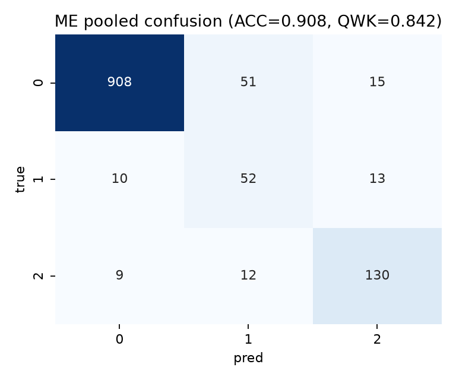

# DR/DME 联合分级系统

基于 Messidor 数据集，对糖尿病视网膜病变（DR 0–3）与黄斑水肿风险（ME 0–2）进行联合分级。

**网络结构**：ConvNeXt-Tiny 主干 → 疾病特异注意力 → 跨任务门控 → DR/ME 双头

## 主要结果

**Binary-init → CORN**（五折 pooled held-out）：

| DR 混淆矩阵 | ME 混淆矩阵 |
|:-----------:|:-----------:|
|  |  |

**Binary-init → Softmax+LDAM**（五折 pooled held-out）：

| DR 混淆矩阵 | ME 混淆矩阵 |
|:-----------:|:-----------:|
|  |  |


| 方法 | DR QWK | ME QWK | Balanced |
|------|--------|--------|----------|
| CORN+DRW | 0.9096 | 0.8727 | 0.8310 |
| Softmax+LDAM+DRW | 0.9028 | 0.8386 | 0.8279 |
| Binary-init → CORN | **0.9072** | **0.8787** | **0.8383** |
| Binary-init → Softmax | 0.9034 | 0.8416 | 0.8323 |

---

## 环境安装

```bash
conda env create -f environment.yml
conda activate dr-dme
```

或手动安装：

```bash
pip install torch torchvision --index-url https://download.pytorch.org/whl/cu124
pip install -r requirements.txt
```

自检（不需要数据，随机张量跑通前向+损失+反传）：

```bash
python scripts/smoke_test.py
```

---

## 数据准备

原始 Messidor 标注为 12 个 Excel 文件（`Annotation_Base*.xls`），图像需自行获取。

**步骤 1**：将标注统一转成 CSV：

```bash
python scripts/convert_messidor_labels.py \
    --ann_dir path/to/messidor_annotations \
    --out data/messidor_labels.csv
```

**步骤 2**：预处理图像（圆形裁剪 + Ben Graham 归一化）并生成五折划分：

```bash
python scripts/prepare_data.py \
    --messidor_csv data/messidor_labels.csv \
    --messidor_dir path/to/messidor_images \
    --out_root data_processed/messidor \
    --image_size 512 --k 5
```

产物：`data_processed/messidor/` 下的预处理图和 `folds.csv`。

---

## 复现主要结果

### 方案一：CORN+DRW 基线

```bash
python scripts/stage2_crossval.py \
    --config configs/stage2_finetune.yaml \
    --output-root checkpoints/corn_cv
```

### 方案二：Softmax+LDAM+DRW 基线

```bash
python scripts/stage2_crossval.py \
    --config configs/stage2_ablate_softmax_ldam.yaml \
    --output-root checkpoints/softmax_ldam_cv
```

### 方案三：Binary-init → CORN（最佳综合结果）

```bash
# Stage 1：先做 0-vs-positive 二分类预训练
python scripts/binary_init_crossval.py \
    --config configs/binary_init.yaml \
    --output-root checkpoints/binary_init_cv

# Stage 2：加载共享权重，做完整等级微调
python scripts/stage2_crossval.py \
    --config configs/a1_binary_init_corn.yaml \
    --shared-cv-root checkpoints/binary_init_cv \
    --output-root checkpoints/a1_corn_cv
```

### 方案四：Binary-init → Softmax+LDAM

```bash
python scripts/binary_init_crossval.py \
    --config configs/binary_init.yaml \
    --output-root checkpoints/binary_init_cv

python scripts/stage2_crossval.py \
    --config configs/a2_binary_init_softmax_ldam_smooth.yaml \
    --shared-cv-root checkpoints/binary_init_cv \
    --output-root checkpoints/a2_softmax_cv
```

---

## 汇总评估与可视化

```bash
# 汇总五折 held-out 指标（混淆矩阵、per-class recall、QWK）
python scripts/summarize_cv_predictions.py \
    --config configs/stage2_finetune.yaml \
    --cv-root checkpoints/corn_cv

# Grad-CAM 热力图（fold 0 验证集前 8 张）
python scripts/run_gradcam.py \
    --config configs/stage2_finetune.yaml \
    --ckpt checkpoints/corn_cv/fold_0/best_qwk.pth \
    --head dr --fold 0
```

---

## 消融实验

消融通过修改 `configs/stage2_finetune.yaml` 中的字段实现：

| 配置项 | 可选值 | 论文对应 |
|--------|--------|----------|
| `model.attention` | `none / specific / cross` | 注意力模块消融 |
| `model.head` | `corn / coral / softmax` | 序数头 vs softmax |
| `loss.type` | `ce / focal / ldam` | 损失函数消融 |
| `loss.drw_defer_epoch` | `0` (去除 DRW) | DRW 延迟策略消融 |
| `train.early_stop_metric` | `qwk_mean / balanced` | 早停指标消融 |

预置消融配置：

```bash
# 去除 DRW（drw_defer_epoch: 0）
python scripts/stage2_crossval.py --config configs/stage2_ablate_drw0.yaml

# 仅以 QWK mean 早停
python scripts/stage2_crossval.py --config configs/stage2_ablate_qwkmean.yaml
```

---

## 显存参考

默认配置：512px / batch 8 / grad_accum 2 / AMP / grad_checkpoint，约需 10G 显存。

OOM 时按顺序调整：

1. `train.batch_size: 4` + `train.grad_accum: 4`
2. `data.image_size: 448`（或 384）
3. 关闭 `model.grad_checkpoint`（显存换速度，需更多显存）

---

## 目录结构

```
drnet/          源码包（data / models / losses / engine / explain / utils）
scripts/        训练、评估、数据准备入口
configs/        各实验配置文件
paper/          论文图表生成脚本
data_processed/ 预处理图像缓存（gitignore）
checkpoints/    训练产物（.pth 已 gitignore）
```
